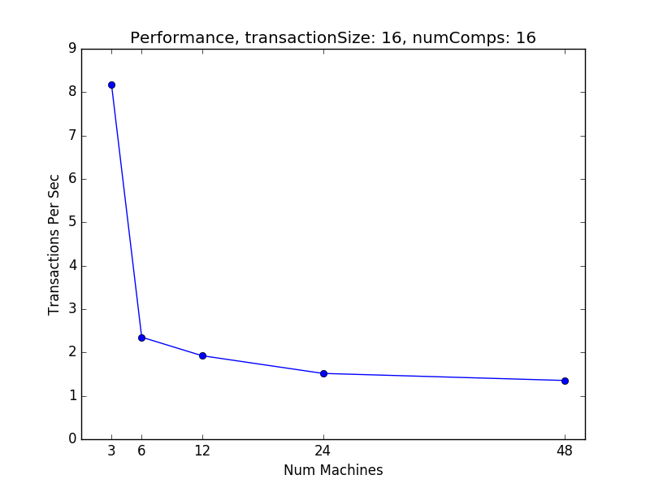

# Jopama

**Jopama** is a scalable transactional key-value store.

**Jopama** provides following highly-desired properties:

- **Consistency** - Always, in all scenarios
- **Scalability for storing components** - Use more servers to store more components - Linear scalability
- **Transaction Processing** - Allows to process transactions on components distributed in the whole system
- **Scalability for processing transactions** - Use more servers to process more transactions - Linear scalability
- **Fault Tolerance** - There is no single point of failures - Number of tolerated failures can be tuned (it is determined by subcluster size)

Jopama has two main components:

- Fault-tolerant non-scalable transactional key-value store (e.g. ZooKeeper) - let's call it **FTNonScalableKVStore**
- Novel fault-tolerant algorithm for distributed transaction processing - let's call it **JopamaAlgorithm**

Jopama stores components (key-value entries) and transactions on instances of *FTNonScalableKVStore*.
*JopamaAlgorithm* is executed by *TransactionProcessors*.
*TransactionProcessors* watch *FTNonScalableKVStore* for transactions.
There is redundancy in *TransactionProcessors* - so that each transaction is detected and processed by *TransactionProcessor* from mutliple nodes.
*JopamaAlgorithm* ensures that single transaction is processed consistently - no metter how many *TransactionProcessors* are processing it.

#### Performance

The main purpose of performance testing was to verify **Jopama** scalability.
We tested particular workloads on different **Jopama** sizes - 3, 6, 12, 24 and 48 servers.

Tested workloads differ in following aspects:

- Number of components in the system - 16, 4096 and 131072 were tested. When number of components is small then there will many conflicting transactions.
- Size of single transaction (number of components used in single transaction) - 2 and 16 were tested. Bigger transaction is processed longer then small transaction.

Single transaction operates on particular components (key-value entries).
Single transaction performs some random permutation on values of these entries - values exchanges between keys.
Before test we create entries in such a way that values are unique.
After test we verify that transactions were processed correctly - by checking that each value is present exactly once.

###### TransactionSize: 2 NumComponents: 131072

Linear scalability.

###### TransactionSize: 2 NumComponents: 4096

Linear scalability.

###### TransactionSize: 2 NumComponents: 16

Bigger **Jopama** system generates more load - in consequence transactions are processed slower.
It is important that **Jopama** ensures consistency/correctness in such a case.

###### TransactionSize: 16 NumComponents: 131072

Linear scalability.

###### TransactionSize: 16 NumComponents: 4096

Bigger **Jopama** system does not increase performance if there are small number of components and many transactions.
At some point bigger **Jopama** system generates more load - in consequence transactions are processed slower.
It is important that **Jopama** ensures consistency/correctness in such a case.

###### TransactionSize: 16 NumComponents: 16

Bigger **Jopama** system generates more load - in consequence transactions are processed slower.
It is important that **Jopama** ensures consistency/correctness in such a case.
